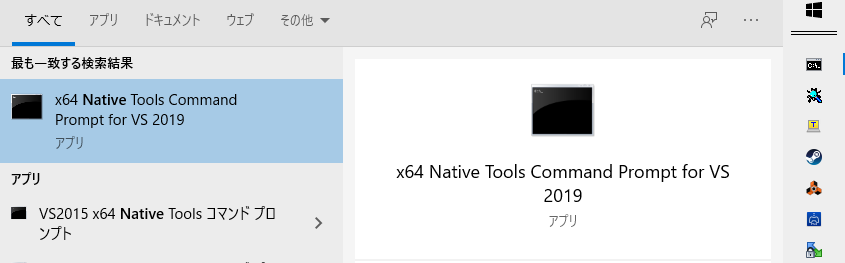
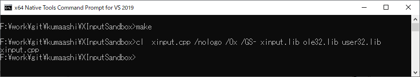
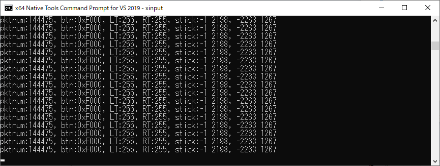

# XInputSandbox
XInput minimal samples for Windows 10

# What's this?

Here's a small sample of XInput. I'm using the XBox360's preferred controller.

XInput seems to support free input in a fairly small amount of code. Very easy to use.

# How to make and run?

1) Wakeup with VS2019 console mode.

2) run make.bat

3) run xinput.exe

3_run.png

# Reference

https://docs.microsoft.com/en-us/windows/win32/xinput/getting-started-with-xinput

# Author

@gyabo

